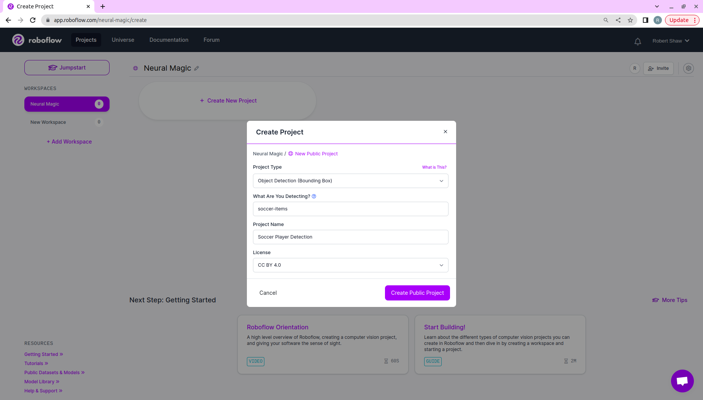
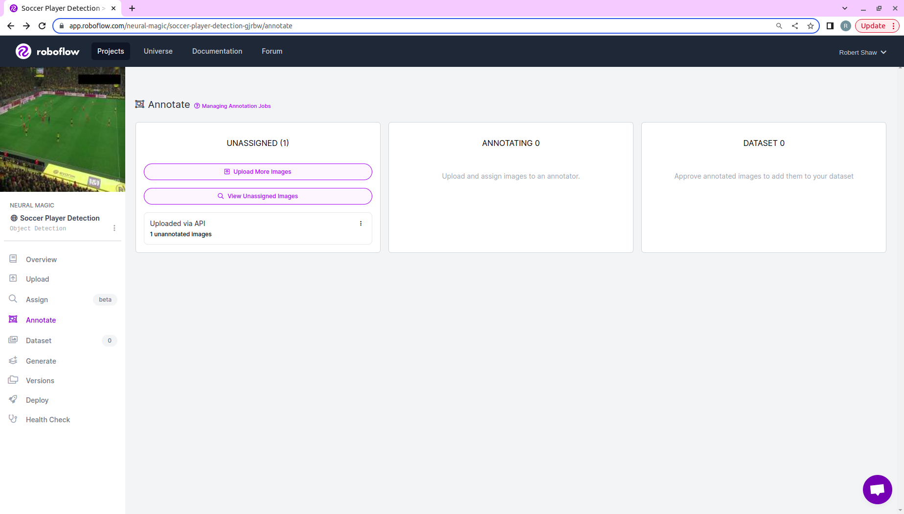

# **Neural Magic + Roboflow**

Neural Magic's DeepSparse is more than just the fastest deep learning inference runtime on CPUs - it also offers 
additional features that make it easy to deploy and manage your models in production.

For instance, DeepSparse Logging can be integrated with Roboflow - a leader in MLOps for Computer Vision - to create
a Continual Learning System.  

## **What Is Continual Learning?**

Full Stack Deep Learning has an [awesome lecture](https://fullstackdeeplearning.com/course/2022/lecture-6-continual-learning/) 
on Continual Learning.

The core insight around the need for Continual Learning is that production models do not have a static data distribution, as 
the inputs will evolve as the enviornment changes. This means that to achieve great performance in production, you need to
continuously monitor your model, gather and label new data, and train new models on fresh data. 
In other words, you can think of Continual Learning as the process around training a sequence of models 
that adapt to the data your model sees in production. 

The workflow looks like this:

<p align="center">
    
</p>

## **Tutorial Overview**

This example will demonstrate how to setup the Continual Learning workflow described above with Neural Magic and Roboflow
to train an object detection model (YOLOv5-s) to detect soccer players in video clips.

There are 5 steps:
1. Deploy a YOLOv5-s model trained on COCO with DeepSparse
2. Log raw images from production to Roboflow
3. Label images with Roboflow
4. Retrain YOLOv5-s on the labeled production data with SparseML
5. Re-deploy the newly trained YOLOv5-s model with DeepSparse

Run the following to install the packages needed for the Tutorial:

```bash
pip install deepsparse[server,yolo,onnx-runtime]
pip install requests pillow requests-toolbelt
```

## **Step 1: Deploy YOLOv5-s with DeepSparse**

DeepSparse is a CPU inference runtime which achieves GPU-class performance on inference-optimized sparse models.
In the object detection domain, Neural Magic has open-sourced pre-sparsified versions of YOLOv5 models, making it easy
to combine the performance of hardware accelerators with the simplicity of software.

### **Benchmarking DeepSparse's Performance**

To give you a sense of runtime's exceptional performance, the DeepSparse package convienent benchmarking script 
that enables you to quickly test throughput. DeepSparse is also integrated with [SparseZoo](https://sparsezoo.neuralmagic.com/), 
an open-source repository of pre-sparsified models, enabling you to quickly download models for testing.

Let's compare DeepSparse's performance to ONNX Runtime to demonstrate the performance speedup.

The following benchmarks were run on a GCP n2-highcpu-16 instance (8 cores).

#### **ONNX Runtime Dense Performance Baseline**

Run the following to pull down the dense version of YOLOv5-s from SparseZoo and compute throughput
for ONNX Runtime with batch-size 64.

```bash
deepsparse.benchmark zoo:cv/detection/yolov5-s/pytorch/ultralytics/coco/base-none -s sync -b 64 -e onnxruntime

#
#
#
```

We can see ONNX Runtime achieves XXX items/second.

#### **DeepSparse Sparse Performance**

Run the following to pull down a pruned-quantized version of YOLOv5-s from SparseZoo and compute
throughput for DeepSparse with batch-size 64.

```bash
deepsparse.benchmark zoo:cv/detection/yolov5-s/pytorch/ultralytics/coco/pruned_quant-aggressive_94 -s sync -b 64 -e deepsparse

#
#
#
```

We can see DeepSparse achieves XXX items/second. This is an XXX performance gain over ORT!

### **Deploying YOLOv5-s with DeepSparse**

Now that we have demonstrated the performance gains from running with DeepSparse, let's take a look at how to add
DeepSparse into an application.

DeepSparse offers both a Pipeline and Server API, enabling you to add DeepSparse to a Python application
or to spin up a model service endpoint. In the case of YOLOv5, DeepSparse has pre-made pipelines
which wrap model inference with pre-processing and post-processing, such that you can pass raw images 
to DeepSparse and recieve the post-processed output.

In our case, we will setup a model service endpoint with DeepSparse Server.

#### **Launching DeepSparse Server**

DeepSparse Server is built on the FastAPI and Uvicorn. 

DeepSparse Server is launched as a CLI command and is configured with a YAML file. The following YAML file
launches a object detection endpoint with DeepSparse running a pruned-quantized version of YOLOv5-s trained
on COCO (identified by the SparseZoo stub below). At current, we only log system metrics (such as request latency)
to standard output.

```yaml
## server-config-no-roboflow-logging.yaml
loggers: 
    python:

endpoints:
  - task: yolo
    model: zoo:cv/detection/yolov5-s/pytorch/ultralytics/coco/pruned_quant-aggressive_94
    name: yolov5-s-coco
    route: /yolov5-s-coco/predict
```

Launch the Server. You should see Uvicorn report that it is running on `http://0.0.0.0:5543`.
```
deepsparse.server --config-file server/server-config-no-roboflow-logging.yaml
```

#### **Send Request to the Server**

Now that the model endpoint is running, we can send raw images over HTTP and recieve back 
the predicted bounding-boxes.

Download and unzip a dataset of soccer games from Roboflow Universe:
```
curl -L "https://universe.roboflow.com/ds/YZbicMV8Z4?key=WrbJD7E7Ky" > roboflow.zip; unzip roboflow.zip; rm roboflow.zip
```

Visit `http://localhost:5543/docs` to see the routes exposed by the DeepSparse Server. 
The following uses the Python `request` package to send a raw image to the `yolov5-s-coco/predict/from_files` route.
We can see that the response includes the bounding boxes, the classes, and the scores.

```python
import requests, json

ENDPOINT_URL = "http://localhost:5543/yolov5-s-coco/predict/from_files"
IMAGE_PATH = "test/images/4b770a_3_6_png.rf.f5d975605c1f73e1a95a1d8edc4ce5b1.jpg"

resp = requests.post(
  url="http://localhost:5543/yolov5-s-coco/predict/from_files",
  files=[('request', open(IMAGE_PATH, 'rb'))]
)

print(json.loads(resp.text))
```

#### **Additional Resources**

- Checkout [Neural Magic's YOLOv5s Documentation](https://docs.neuralmagic.com/use-cases/object-detection/deploying) for more details on deploying YOLOv5s with DeepSparse
- Checkout [Neural Magic's DeepSparse Server Documentation](https://docs.neuralmagic.com/user-guide/deploying-deepsparse/deepsparse-server) for more details DeepSparse Server

## **Step 2: Log Production Data To Roboflow**

Now that we have DeepSparse Server up and running, let's configure DeepSparse to log data to Roboflow.

### **Set Up a Roboflow Project**

First, create a free account with [Roboflow](https://roboflow.com/) and create a new project.

<p align="center">
    
</p>

Next, we will use Roboflow's [Upload API](https://docs.roboflow.com/adding-data/upload-api#uploading-with-multipart-form-data-recommended) from within
the DeepSparse Logging system.

[DeepSparse Logging](https://docs.neuralmagic.com/user-guide/deepsparse-engine/logging) enables you to log arbitrary data
or functions thereof at each stage of an inference pipeline. DeepSparse has pre-made integrations 
with common monitoring stacks like Prometheus/Grafana, but also is extensible enough to allow custom loggers to be created.

`roboflow-logger.py` shows how to create a custom logger that uses using the Roboflow Upload API by inheriting
from the `BaseLogger` class in DeepSparse.

```python
from deepsparse.loggers import BaseLogger, MetricsCategories
from typing import Any, Optional
from PIL import Image
import io, requests, datetime
from requests_toolbelt.multipart.encoder import MultipartEncoder

class RoboflowLogger(BaseLogger):
    def __init__(self, dataset_name: str, api_key: str):
        self.upload_url = f"https://api.roboflow.com/dataset/{dataset_name}/upload?api_key={api_key}"
        super(RoboflowLogger, self).__init__()

    def log(self, identifier: str, value: Any, category: Optional[str]=None):
        if category == MetricsCategories
            # unpacks value and converts to image in a buffer          
            img = Image.fromarray(value.images[0], mode="RGB")
            buffered = io.BytesIO()
            img.save(buffered, quality=90, format="JPEG")
            
            # packs as multipart
            img_name = f"production-image-{datetime.datetime.now()}.jpg"
            m =  MultipartEncoder(fields={'file': (img_name, buffered.getvalue(), "image/jpeg")})

            # uploads to roboflow
            r = requests.post(self.upload_url, data=m, headers={'Content-Type': m.content_type})
```

With the `RoboflowLogger` created, update the Server configuration as follows filling in 
your Roboflow dataset name (you can see it in the URL of the Roboflow project you created)
 and your [Roboflow API key](https://docs.roboflow.com/rest-api#obtaining-your-api-key).

```yaml
# server-config-roboflow-logging.yaml
loggers:
  roboflow_logger:
    path: server/roboflow-logger.py:RoboflowLogger
    api_key: YOUR_API_KEY
    dataset_name: YOUR_DATASET_NAME

endpoints:
  - task: yolo
    model: zoo:cv/detection/yolov5-s/pytorch/ultralytics/coco/pruned_quant-aggressive_94
    name: yolov5-s-coco
    route: /yolov5-s-coco/predict
    data_logging:
      pipeline_inputs:
        - func: identity
          frequency: 1
          target_loggers:
            - roboflow_logger
```

You will notice that we added a `roboflow_logger`, which is created by referencing the code 
provided in the `roboflow-logger.py`. When DeepSparse instantiates the `RoboflowLogger` class,
it will pass the `dataset_name` and `api_key` to the constructor. 

In additionn, we added a `data_logging` section to the YOLOv5-s endpoint. This configures DeepSparse to
call `RoboflowLogger.log()` method, which sends data to Roboflow via the Upload API,
on the raw pipeline inputs at a frequency of 1 (i.e. every request). 

We are now ready to start collecting data! 

Launch the Server with the new configuration file.
```
deepsparse.server --config-file server/server-config-roboflow-logging.yaml
```

Send a request to the Server as before.
```python
import requests, json

ENDPOINT_URL = "http://localhost:5543/yolov5-s-coco/predict/from_files"
IMAGE_PATH = "test/images/4b770a_3_6_png.rf.f5d975605c1f73e1a95a1d8edc4ce5b1.jpg"

resp = requests.post(
  url="http://localhost:5543/yolov5-s-coco/predict/from_files",
  files=[('request', open(IMAGE_PATH, 'rb'))]
)

print(json.loads(resp.text))
```

You should see the image ready to be annotated in Roboflow!

<p align="center">
    
</p>