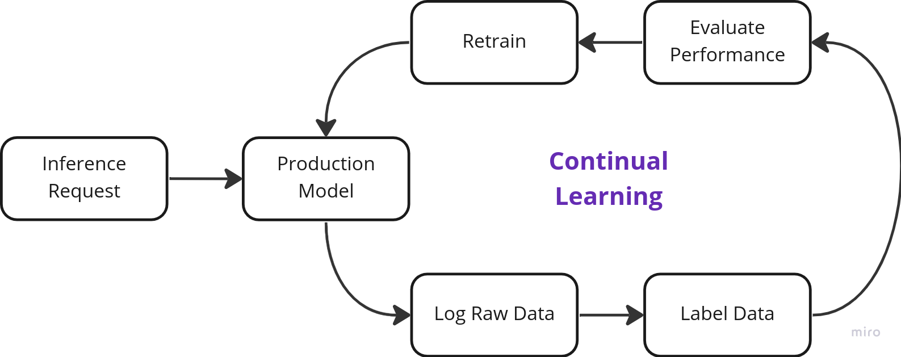
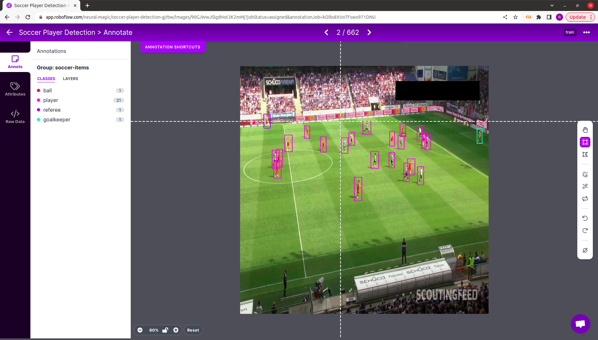
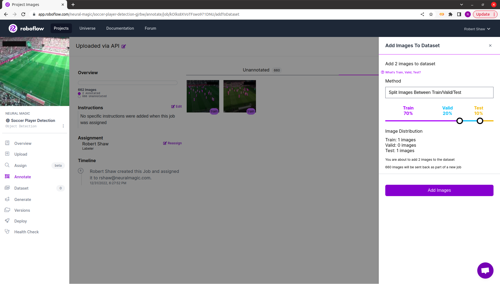
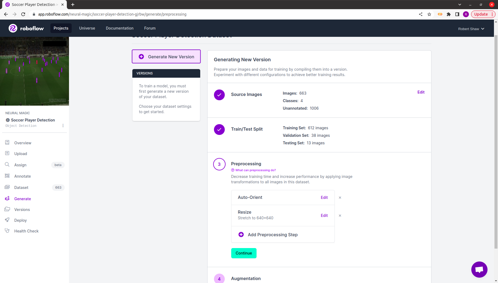
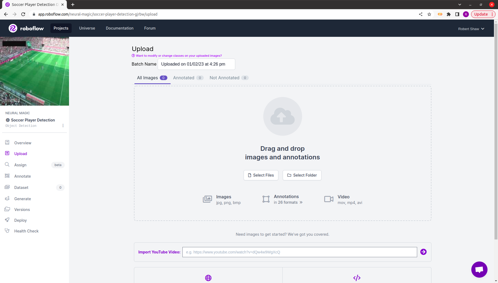
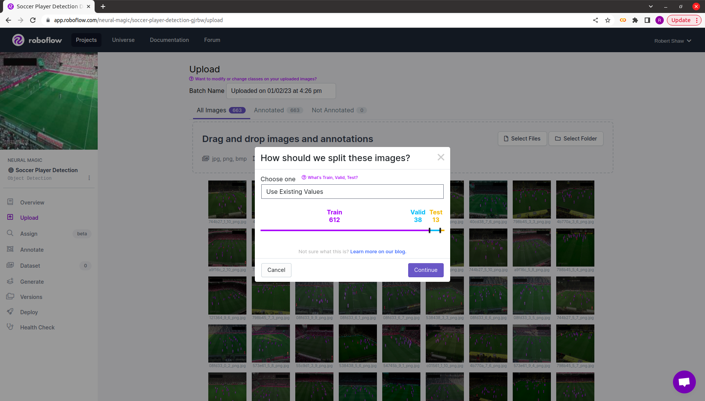
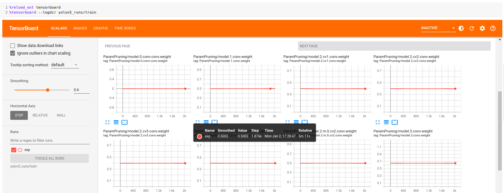
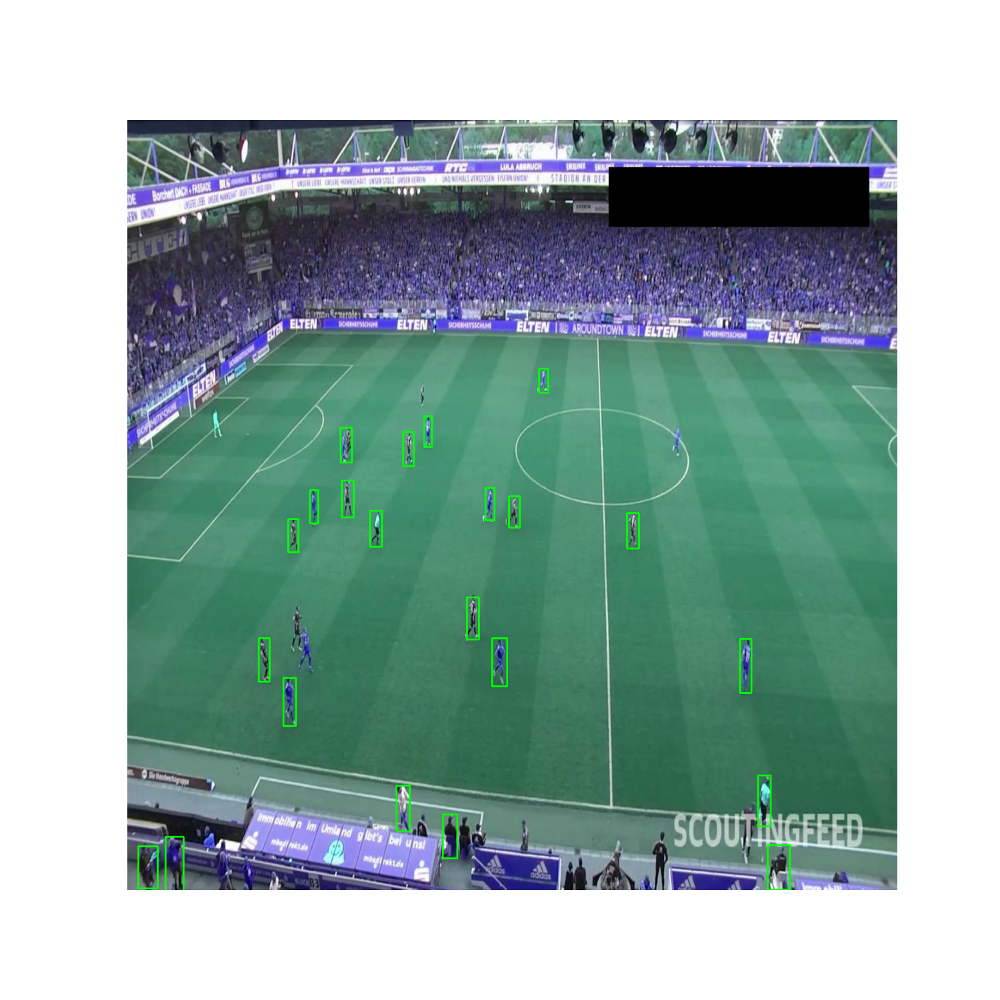
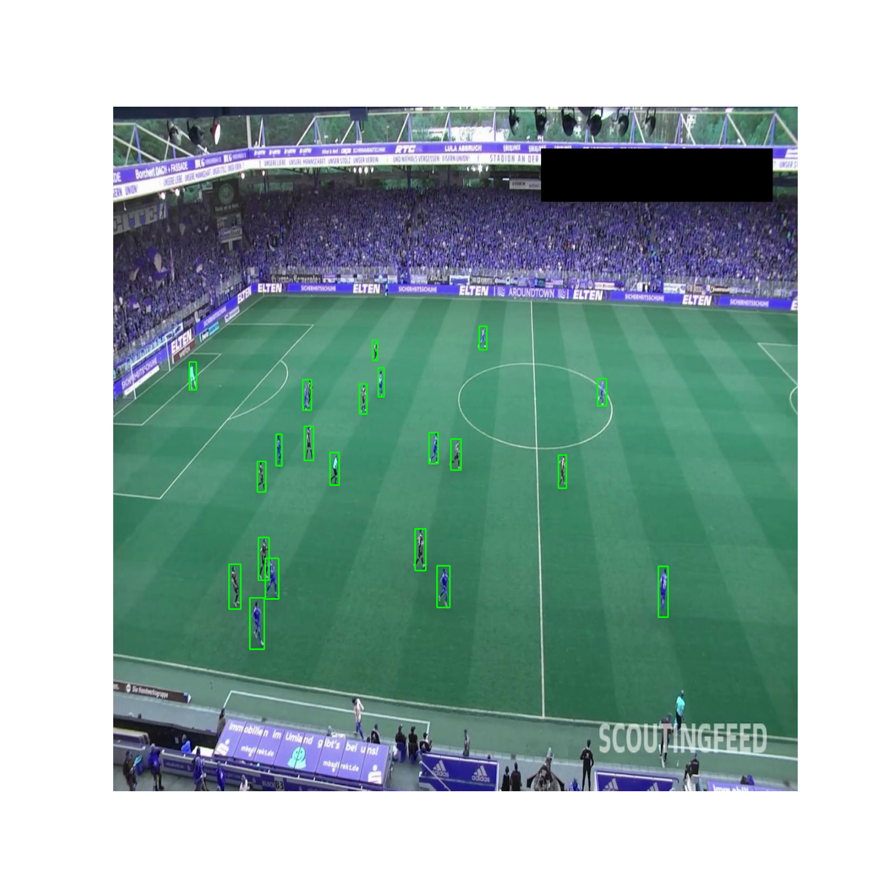

# **Neural Magic + Roboflow**

Neural Magic's DeepSparse is more than just the fastest deep learning inference runtime on CPUs - it also offers 
additional features that make it easy to deploy and manage your models in production.

For instance, DeepSparse Logging can be integrated with Roboflow - a leader in MLOps for Computer Vision - to create
a Continual Learning System.  

## **What Is Continual Learning?**

Full Stack Deep Learning has an [awesome lecture](https://fullstackdeeplearning.com/course/2022/lecture-6-continual-learning/) 
on Continual Learning.

The core insight around the need for Continual Learning is that production models do not have a static data distribution, as 
the inputs will evolve as the enviornment changes. This means that to achieve great performance in production, you need to
continuously monitor your model, gather and label new data, and train new models on fresh data. 
In other words, you can think of Continual Learning as the process around training a sequence of models 
that adapt to the data your model sees in production. 

The workflow looks like this:

<p align="center">
    
</p>

## **Tutorial Overview**

This example will demonstrate how to setup the Continual Learning workflow described above with Neural Magic and Roboflow
to train an object detection model (YOLOv5-s) to detect soccer players in video clips.

There are 5 steps:
1. Deploy a YOLOv5-s model trained on COCO with DeepSparse
2. Log raw images from production to Roboflow
3. Label images with Roboflow
4. Retrain YOLOv5-s on the labeled production data with SparseML
5. Re-deploy the newly trained YOLOv5-s model with DeepSparse

Run the following to install the packages needed for the Tutorial:

```bash
pip install deepsparse[server,yolo,onnxruntime]
pip install requests pillow requests-toolbelt
```

## **Step 1: Deploy YOLOv5-s with DeepSparse**

DeepSparse is a CPU inference runtime which achieves GPU-class performance on inference-optimized sparse models.
Neural Magic has open-sourced pre-sparsified versions of YOLOv5 models, making it easy to reach the performance of 
hardware accelerators in the object detection domain.

### **Benchmarking DeepSparse's Performance**

To give you a sense of runtime's exceptional performance, the DeepSparse package contains a convienent benchmarking script 
that enables you to quickly test throughput. DeepSparse is also integrated with [SparseZoo](https://sparsezoo.neuralmagic.com/), 
an open-source repository of pre-sparsified models, enabling you to quickly download models for testing.

The following benchmarks were run on an AWS `c6i.8xlarge` instance (16 cores).

#### **ONNX Runtime Dense Performance Baseline**

Let's checkout ONNX Runtime's performance to generate a baseline.

Run the following to pull down the dense version of YOLOv5-s from SparseZoo and compute throughput
for ONNX Runtime with batch-size 64.

```bash
deepsparse.benchmark zoo:cv/detection/yolov5-s/pytorch/ultralytics/coco/base-none -s sync -b 64 -e onnxruntime

# Original Model Path: zoo:cv/detection/yolov5-s/pytorch/ultralytics/coco/base-none
# Batch Size: 64
# Scenario: sync
# Throughput (items/sec): 41.3004
# Latency Mean (ms/batch): 1548.2591
# Latency Median (ms/batch): 1547.9347
# Latency Std (ms/batch): 2.5794
# Iterations: 7
```

We can see ONNX Runtime achieves 41 items/second.

#### **DeepSparse Sparse Performance**

Run the following to pull down a pruned-quantized version of YOLOv5-s from SparseZoo and compute
throughput for DeepSparse with batch-size 64.

```bash
deepsparse.benchmark zoo:cv/detection/yolov5-s/pytorch/ultralytics/coco/pruned_quant-aggressive_94 -s sync -b 64 -e deepsparse

# Original Model Path: zoo:cv/detection/yolov5-s/pytorch/ultralytics/coco/pruned_quant-aggressive_94
# Batch Size: 64
# Scenario: sync
# Throughput (items/sec): 271.9079
# Latency Mean (ms/batch): 235.3557
# Latency Median (ms/batch): 235.3323
# Latency Std (ms/batch): 0.6422
# Iterations: 43
```

We can see DeepSparse achieves 272 items/second. This is an **6.7x performance gain over ORT**!

### **Deploying YOLOv5-s with DeepSparse**

Now that we have demonstrated the performance gains from running with DeepSparse, let's take a look at how to add
DeepSparse into an application.

DeepSparse offers both a Pipeline and Server API, enabling you to add DeepSparse to a Python application
or to spin up a model service endpoint. In the case of YOLOv5, DeepSparse has pre-made pipelines
which wrap model inference with pre-processing and post-processing, such that you can pass raw images 
to DeepSparse and recieve the predicted bounding boxes and classes.

In our case, we will setup a model service endpoint with DeepSparse Server.

#### **Launching DeepSparse Server**

DeepSparse Server is launched as a CLI command and is configured with a YAML file. The following YAML file
launches a object detection endpoint with DeepSparse running a pruned-quantized version of YOLOv5-s trained
on COCO (identified by the SparseZoo stub).

```yaml
## server-config-no-roboflow-logging.yaml
loggers: 
    python:

endpoints:
  - task: yolo
    model: zoo:cv/detection/yolov5-s/pytorch/ultralytics/coco/pruned_quant-aggressive_94
    name: yolov5-s-coco
    route: /yolov5-s-coco/predict
```

Launch the Server. You should see Uvicorn report that it is running on `http://0.0.0.0:5543`.
```
deepsparse.server --config-file server/server-config-no-roboflow-logging.yaml
```

#### **Send Request to the Server**

Now that the model endpoint is running, we can send raw images over HTTP and recieve back 
the predicted bounding-boxes.

Download and unzip a dataset of soccer games from Roboflow Universe:
```
curl -L "https://universe.roboflow.com/ds/YZbicMV8Z4?key=WrbJD7E7Ky" > roboflow.zip; unzip roboflow.zip; rm roboflow.zip
```

The following uses the Python `request` package to send a raw image to the `yolov5-s-coco/predict/from_files` route.
We can see that the response includes the bounding boxes, the classes, and the scores.

```python
import requests, json

ENDPOINT_URL = "http://localhost:5543/yolov5-s-coco/predict/from_files"
IMAGE_PATH = "test/images/4b770a_3_6_png.rf.f5d975605c1f73e1a95a1d8edc4ce5b1.jpg"

resp = requests.post(
  url=ENDPOINT_URL,
  files=[('request', open(IMAGE_PATH, 'rb'))]
)

print(json.loads(resp.text))
```

## **Step 2: Log Production Data To Roboflow**

Now that we have DeepSparse Server up and running, let's configure DeepSparse to log incoming images to Roboflow.

### **Set Up a Roboflow Project**

First, create a free account with [Roboflow](https://roboflow.com/) and create a new project.

<p align="center">
    
</p>

### **Create a Custom Roboflow Logger for DeepSparse**

[DeepSparse Logging](https://docs.neuralmagic.com/user-guide/deepsparse-engine/logging) enables you to log arbitrary data
or functions thereof at each stage of an inference pipeline to the logging system of your choice. While DeepSparse has pre-made integrations with common monitoring stacks like Prometheus/Grafana, also allows you to create custom loggers.

`roboflow-logger.py` shows how to create a custom logger (inheriting from the `BaseLogger` abstract class) which uses Roboflow's [Upload API](https://docs.roboflow.com/adding-data/upload-api#uploading-with-multipart-form-data-recommended) to log images to
a Roboflow dataset.

```python
from deepsparse.loggers import BaseLogger, MetricsCategories
from typing import Any, Optional
from PIL import Image
import io, requests, datetime
from requests_toolbelt.multipart.encoder import MultipartEncoder

class RoboflowLogger(BaseLogger):
    def __init__(self, dataset_name: str, api_key: str):
        # per Roboflow docs
        self.upload_url = f"https://api.roboflow.com/dataset/{dataset_name}/upload?api_key={api_key}"
        super(RoboflowLogger, self).__init__()

    def log(self, identifier: str, value: Any, category: Optional[str]=None):
        if category == MetricsCategories.DATA:
            # unpacks value and converts to image in a buffer          
            img = Image.fromarray(value.images[0], mode="RGB")
            buffered = io.BytesIO()
            img.save(buffered, quality=90, format="JPEG")
            
            # packs as multipart
            img_name = f"production-image-{datetime.datetime.now()}.jpg"
            m =  MultipartEncoder(fields={'file': (img_name, buffered.getvalue(), "image/jpeg")})

            # uploads to roboflow
            r = requests.post(self.upload_url, data=m, headers={'Content-Type': m.content_type})
```

### **Configure DeepSparse Server to Use the Roboflow Logger**

With the `RoboflowLogger` created, let's update the Server configuration to log the pipeline inputs to Roboflow. 
Fill in your Roboflow dataset name (you can see it in the URL of the Roboflow project you created)
and your [Roboflow API Key](https://docs.roboflow.com/rest-api#obtaining-your-api-key).

```yaml
# server-config-roboflow-logging.yaml
loggers:
  roboflow_logger:
    path: server/roboflow-logger.py:RoboflowLogger
    api_key: YOUR_API_KEY
    dataset_name: YOUR_DATASET_NAME

endpoints:
  - task: yolo
    model: zoo:cv/detection/yolov5-s/pytorch/ultralytics/coco/pruned_quant-aggressive_94
    name: yolov5-s-coco
    route: /yolov5-s-coco/predict
    data_logging:
      pipeline_inputs:
        - func: identity
          frequency: 1 # logs every image
          target_loggers:
            - roboflow_logger
```

> For more details on configuration syntax, [checkout the DeepSparse Logging documentation](https://docs.neuralmagic.com/user-guide/deepsparse-engine/logging).

We are now ready to start collecting data!

### **Collect Data**

Launch the Server with the new configuration file.
```
deepsparse.server --config-file server/server-config-roboflow-logging.yaml
```

Send a request to the Server as before.
```python
import requests, json

ENDPOINT_URL = "http://localhost:5543/yolov5-s-coco/predict/from_files"
IMAGE_PATH = "test/images/4b770a_3_6_png.rf.f5d975605c1f73e1a95a1d8edc4ce5b1.jpg"

resp = requests.post(
  url=ENDPOINT_URL,
  files=[('request', open(IMAGE_PATH, 'rb'))]
)

print(json.loads(resp.text))
```

You should see the image ready to be annotated in Roboflow!

<p align="center">
    
</p>

#### **Simulating Production**

Let's simulate a production setting where we collect data from many client requests.The following script loops through the soccer images we downloaded from the Roboflow Universe and sends them to the DeepSparse Server.

```python
import requests, json, os, time

# the dataset we downloaded had 3 subsets in 3 folders
paths = []
for folder_name in ['test', 'valid', 'train']:
    path = f"{folder_name}/images/"
    paths += [path + img_name for img_name in os.listdir(path)]
    

# same URL for the endpoint as before
ENDPOINT_URL = "http://localhost:5543/yolov5-s-coco/predict/from_files"

# send each image to the endpoint
print(f"Sending {len(paths)} images to the server")
for image_path in paths:    
    resp = requests.post(
      url=ENDPOINT_URL,
      files=[('request', open(image_path, 'rb'))]
    )
    print(resp)
    time.sleep(1)
```

Note that we include a 1s delay in between requests. In this demo, we configured DeepSparse to log 
every image (`frequency=1`) to a remote API, which will overload the Server if requests arrive continuously. 

***In an actual productions setting, you will likely want to send only a sample of images up to the server if you are recieving requests continously (for example, logging 1 out of every 10000 requests with `frequency=10000`).***

Run the script with the following:

```bash
python3 client-send-all.py
```

Once this is complete, you should see 663 images ready to be labeled in Roboflow!

## Step 3: Label Images With Roboflow

*Note: This section shows the workflow for labeling images with Roboflow. There are 663 images
in the dataset, which can take significant time to label. Fortunately, there are labels for this
dataset available in the Roboflow Universe, which we can upload directly to the project to save 
time for the purposes of this demo.*

Now that the unlabled images are in Roboflow, navigate to the Annotate tab in your Project on the Web UI.

First, follow the prompts to assign the unlabeled images to a user (likely yourself).

Then, use the web UI to add bounding boxes to the images with the following four classes:
1. ball
2. goalkeeper
3. player
4. referee

<p align="center">
  
</p>

Finally, once you have labeled all of the images, add them to the dataset, splitting between Train, Test, and Validation.

<p align="center">
  
</p>

Once the 663 images have been uploaded, Roboflow provides the option to perform pre-processing, augmentation, and generation to the dataset. In our case, we will train with images of size 640x640, so leave all of the default options in place.

<p align="center">
  
</p>

Your dataset is ready for training!

### **Shortcut: Uploading Labeled Images From Roboflow Universe**

As mentioned above, the [dataset we are using has labels in the Roboflow Universe](https://universe.roboflow.com/roboflow-jvuqo/football-players-detection-3zvbc/dataset/2), so we can skip the manual labeling for the purposes of this demo.

Run the following to download the data with labels in the YOLOv5 format:
```bash
mkdir data-with-labels; cd data-with-labels; curl -L "https://universe.roboflow.com/ds/YZbicMV8Z4?key=WrbJD7E7Ky" > roboflow.zip; unzip roboflow.zip; rm roboflow.zip
```

Navigate to the Upload page on the Roboflow WebUI, and upload the `data-with-labels` folder.

<p align="center">
  
</p>

Once the 663 images have been added, click Save and Continue in the top right corner. Select `Use Existing Value` when defining how to split the images into Training, Validation, and Testing sets.  

<p align="center">
  
</p>

Once the 663 images have been uploaded, Roboflow provides the option to perform pre-processing, augmentation, and generation to the dataset. In our case, we will train with images of size 640x640, so leave all of the default options in place.

<p align="center">
  
</p>

Your dataset is ready for training!

https://docs.roboflow.com/command-line-interface#upload-images-using-the-roboflow-cli

## **Step 4: Re-train the Model on Production Data**

In this step, we will use Neural Magic's SparseML and Roboflow's Datasets API to train a sparsified YOLOv5 onto the
data we gathered from production.

We have provided a [Colab Notebook](https://colab.research.google.com/drive/1e0zE6vGokh8LuXpDWhTzm-nelTHlrrFU#scrollTo=iHWjewb5FRsL)
withe full end-to-end training flow.

### **Download Data From Roboflow to Your Training Enviornment**

Roboflow has a convient Python API for downloading datasets. The following code
pulls down the train, validation, and test data with labels in the YOLOv5 format.

```python
from roboflow import Roboflow

API_KEY = "YOUR_API_KEY" # https://docs.roboflow.com/rest-api#obtaining-your-api-key
PROJECT_NAME = "YOUR_PROJECT_NAME"
WORKSPACE_NAME = "YOUR_WORKSPACE_NAME"

# connect to Roboflow with API_KEY, select project
rf = Roboflow(api_key=API_KEY)
project = rf.workspace(WORKSPACE_NAME).project(PROJECT_NAME)

# download the dataset in yolov5 format
dataset = project.version(1).download("yolov5")
```

### **Train with SparseML**

SparseML is an open-source optimization library, developed by Neural Magic, 
which allows you to create sparse models trained on your dataset. There are two main workflows:
1. **Sparsification From Scratch**: allows you to apply pruning and quantization algorithms to arbitrary dense models,
enabling you to compress and optimize your models for inference.
2. **Sparse Transfer Learning**: allows you to transfer learn from pre-sparsified checkpoint, while maintaining model
sparsity as fine-tuning occurs.

Sparse Transfer Learning is the preferred and easier pathway if a pre-sparsified version of a model exists in the SparseZoo. Sicne there are pre-sparsified checkpoints available for YOLOv5 in the SparseZoo, this is the pathway we will follow. 

#### **Kick Off Sparse Transfer Learning**

SparseML is integrated with Ultralytics YOLOv5, so we can use a familiar CLI script to launch training. In addition to the
typical YOLOv5 arguments, however, SparseML uses a `recipe` argument. Recipes are YAML files that encode the hyperparameters of the
sparsity algorithms. SparseZoo contains Sparse Transfer Learning recipes, which instruct SparseML to maintain sparsity levels
as the training occurs, which can be passed to SparseML via a SparseZoo stub. 

The following script pulls down the pruned-quantized checkpoint for YOLOv5s (`--weights` points to a SparseZoo stub)
and the sparse transfer learning recipe for YOLOv5s (`--recipe` points to a SparseZoo stub) from SparseZoo and starts the training
process with the dataset previously downloaded from Roboflow.

```bash
sparseml.yolov5.train \
    --weights zoo:cv/detection/yolov5-s/pytorch/ultralytics/coco/pruned_quant-aggressive_94?recipe_type=transfer \
    --recipe zoo:cv/detection/yolov5-s/pytorch/ultralytics/coco/pruned_quant-aggressive_94?recipe_type=transfer \
    --cfg models_v5.0/yolov5s.yaml \
    --hyp data/hyps/hyp.finetune.yaml \
    --data /content/Soccer-Player-Detection-1/data.yaml \
    --cache 'ram'
```

The training runs for 50 epochs, with final results by class looking like the following:

```
Class     Images     Labels          P          R     mAP@.5 mAP@.5:.95
  all         38        905      0.965      0.227      0.279      0.148
    0         38         35          1          0          0          0
    1         38         27          1          0     0.0709     0.0342
    2         38        754      0.858       0.91      0.893      0.474
    3         38         89          1          0      0.151     0.0835
```

The model has a hard time picking up on classes 0, 1, and 3 (ball, goalkeeper, and referee), but does a nice job of identifying the players (which make up most of the objects in the training set).

Pulling up the TensorBoard (`--logdir yolov5_runs/train`), we can see that sparsity levels (as seen in the `ParamPruning` group) remain flat for every layer of the model as the fine-tuning occured - SparseML is doing its job!

<p align="center">
  
</p>

#### **Export to ONNX**

DeepSparse accepts models in the ONNX format. Run the following to convert the final PyTorch checkpoint to ONNX.

```
sparseml.yolov5.export_onnx --weights yolov5_runs/train/exp/weights/last.pt --dynamic
```

This creates an ONNX file representing the model at `yolov5_runs/train/exp/weights/last.onnx`.

## **Step 5: Redeploy the New Model**

We will create a new configuration file for the server which contains two endpoints - one with the sparse YOLOv5s
trained on COCO and the sparse YOLOv5s fine-tuned on the production data.

Note that we provided a `last.onnx` file (which we trained in the manner described above) in the `server` directory.
You can swap a path to your ONNX file if desired.

```yaml
# server-config-multiple-endpoints.yaml
loggers: 
    python:

endpoints:
  - task: yolo
    model: zoo:cv/detection/yolov5-s/pytorch/ultralytics/coco/pruned_quant-aggressive_94
    name: yolov5-s-coco
    route: /yolov5-s-coco/predict
  
  - task: yolo
    model: server/last.onnx     # update with a path to your onnx file
    name: yolov5-s-finetuned
    route: /yolov5-s-finetuned/predict
```

Launch as before:
```
deepsparse.server --config-file server/server-config-multiple-endpoints.yaml
```

Send a request to the YOLOv5s model trained on COCO:

```python
import requests, json

ENDPOINT_URL = "http://localhost:5543/yolov5-s-coco/predict/from_files"
IMAGE_PATH = "test/images/4b770a_3_6_png.rf.f5d975605c1f73e1a95a1d8edc4ce5b1.jpg"

resp = requests.post(
  url=ENDPOINT_URL,
  files=[('request', open(IMAGE_PATH, 'rb'))]
)

print(json.loads(resp.text))
```

Send a request to the YOLOv5s model fine-tuned on the production data:
```python
import requests, json

ENDPOINT_URL = "http://localhost:5543/yolov5-s-finetuned/predict/from_files"
IMAGE_PATH = "test/images/4b770a_3_6_png.rf.f5d975605c1f73e1a95a1d8edc4ce5b1.jpg"

resp = requests.post(
  url=ENDPOINT_URL,
  files=[('request', open(IMAGE_PATH, 'rb'))]
)

print(json.loads(resp.text))
```

The following sends requests to the server and annotates the images with the bounding boxes, saving the output as files.

```
python client-multiple-endpoints.py
```

We can see that the fine-tuned model does a better job than the off-the-shelf COCO trained model:

YOLOv5s Trained on COCO        | YOLOv5s Finetuned on Production Data
:-----------------------------:|:------------------------------------:
 | 

## **Wrapping Up**

You have successfully created a data flywheel for continual learning with DeepSparse and Roboflow!
